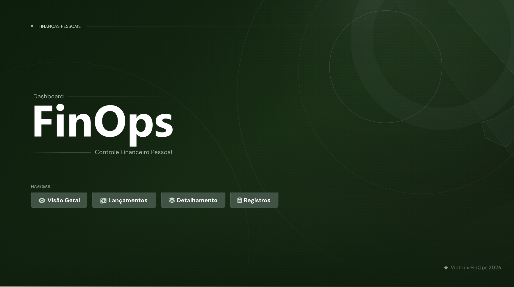
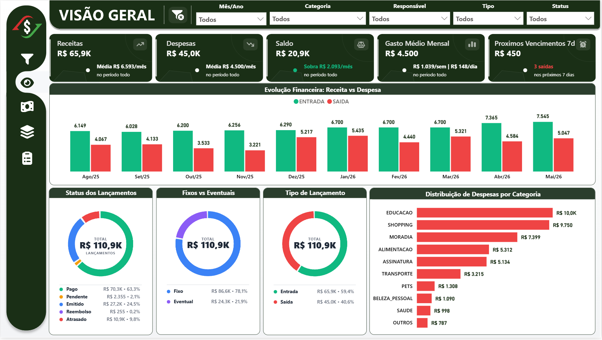
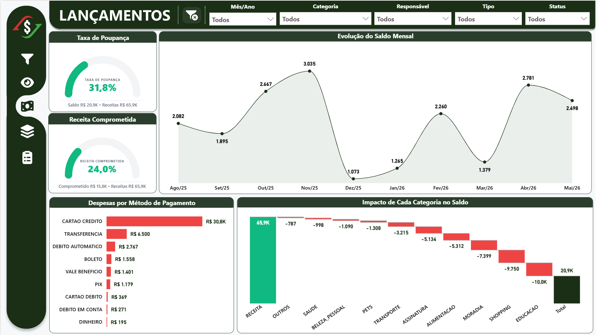
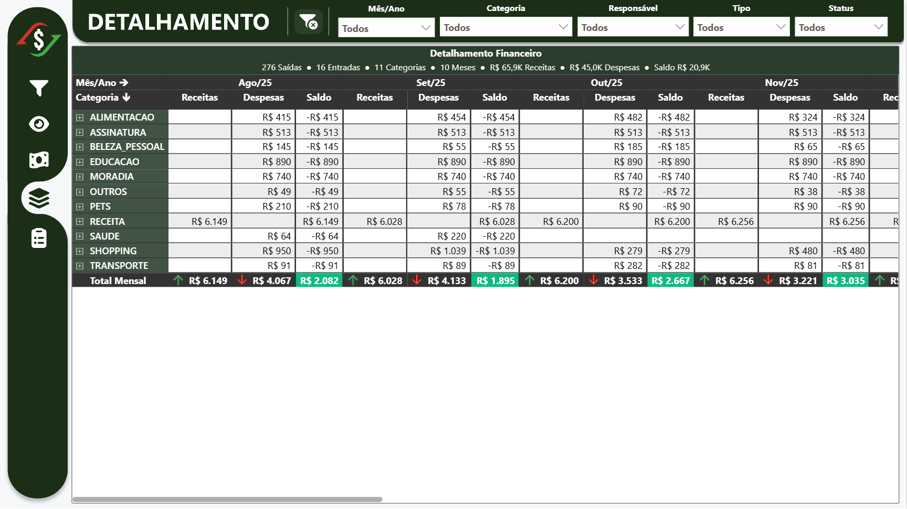
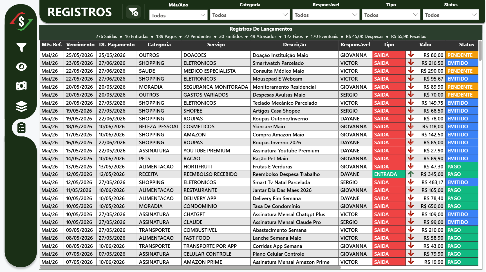

<div align="center">

# 💰 FinOps — Personal Finance Dashboard

**Power BI · Excel VBA · DAX · Power Query**

[](https://linkedin.com/in/victor-ozores/)
[](https://app.xperiun.com/in/victor-ozores)
[](https://github.com/victor-ozores)

</div>

---

## Resumo

Dashboard de controle financeiro pessoal construído do zero com Excel como fonte de dados e Power BI como camada de visualização — sem custo, sem plataforma externa.

O problema era simples: eu gastava mais do que percebia e não sabia para onde o dinheiro ia, especialmente no cartão de crédito. O dashboard mostra o que já fechou na fatura, o que está pendente, quanto foi gasto por categoria e qual é a taxa de poupança real do período.

O usuário cadastra os lançamentos na planilha — fixos mensalmente, eventuais a cada compra. A planilha conta com automações que ajudam no processo, e o Power BI reflete tudo após o refresh.

---

## O Que Ele Responde

- Quanto gastei este mês e em qual categoria?
- O que já entrou na fatura do cartão vs. o que ainda está em aberto?
- Meu saldo cobre os próximos vencimentos?
- Qual é minha taxa de poupança real?
- Estou gastando mais ou menos do que no mês anterior?

---

## Páginas do Dashboard

| Página | O que entrega |
|--------|---------------|
| **Visão Geral** | Panorama completo: receita, despesa, saldo, próximos vencimentos 7 dias, distribuição por categoria |
| **Lançamentos** | Taxa de poupança, receita comprometida, waterfall de impacto por categoria no saldo |
| **Detalhamento** | Matriz Categoria × Mês com drill-down por lançamento individual |
| **Registros** | Tabela completa de todos os lançamentos com status, método e tipo |

---

## 🔗 Ver Dashboard Online

[](https://app.powerbi.com/view?r=eyJrIjoiOTExYjkzNGUtNDcyNi00NDRhLTlhNWUtMTgzMjkxOTdiMWY2IiwidCI6IjY1OWNlMmI4LTA3MTQtNDE5OC04YzM4LWRjOWI2MGFhYmI1NyJ9&pageName=431d226465d4e320e2a1)

---

## 📸 Preview

### Home


### Visão Geral


### Lançamentos


### Detalhamento


### Registros


---

## 🎬 Tutorial em Vídeo

> Como preencher a planilha, cadastrar lançamentos, entender o sistema de cartões e usar o dashboard no dia a dia.

📺 **Playlist completa:** `[ em breve ]`

---

## 📲 Quero Usar Pessoalmente

O projeto é aberto, mas a planilha tem configurações específicas.
Se quiser usar ou adaptar para o seu controle financeiro, me chama:

**WhatsApp → [11 99486-6027](https://wa.me/5511994866027)**

---

<details>
<summary>⚙️ Detalhes Técnicos</summary>

<br>

### Arquitetura

```
Excel (.xlsm)
  ├── tbl_Lancamentos_Fixos        ← lançamentos recorrentes (mensal, semanal, trimestral...)
  ├── tbl_Lancamentos_Eventuais    ← compras pontuais e parcelamentos
  ├── tbl_Base_Cartoes_Credito     ← cadastro de cartões com dia de fechamento e vencimento
  ├── tbl_Base_Sistema             ← configurações: categorias, métodos, status, responsáveis
  ├── tbl_Base_User                ← serviços por categoria, editável livremente
  └── tbl_Projecao_Lancamentos_Fixos ← controle de projeções (100% automático)
        │
        ▼ VBA (9 módulos — automações que ajudam no processo ao abrir)
        │
        ▼ Power Query (ETL)
        │
        ▼ Star Schema
  ├── Fact_Lancamentos
  ├── Dim_Calendario (tabela DAX, 28 colunas)
  └── Dim_Cartoes_Credito
        │
        ▼ 128 medidas DAX · 7 UDFs
        │
        ▼ Report (4 páginas)
```

---

### VBA — 9 Módulos

| Módulo | O que faz |
|--------|-----------|
| `mod01FilaGlobal` | Orquestrador — executa os 8 módulos em sequência via `Workbook_Open` ou botão |
| `modReorganizarColunas` | Ordena colunas e valores de `tbl_Base_User` e `tbl_Base_Sistema` alfabeticamente, preservando cores de fundo |
| `modPreencherFrequencia` | Preenche `FREQUENCIA = "MENSAL"` automaticamente quando vazio |
| `modFilaCore` | Motor de projeção de fixos — chave composta `RESPONSAVEL|SERVICO|VALOR|TIPO`, suporta 7 frequências, dialog por bloco |
| `modParcelamento` | Gera parcelas 2..N automaticamente com GUID 32-hex, STATUS por método, preserva fórmulas e Data Validation |
| `modValidacaoCartaoCredito` | Limpa campo `CARTAO` quando `METODO_PAGAMENTO ≠ CARTAO CREDITO` |
| `modStatusPendente` | Auto-preenche STATUS: `EMITIDO` para cartão, `PENDENTE` para demais |
| `modStatusAtrasado` | Espelha a lógica do Power Query: atualiza STATUS para `ATRASADO` quando vencido |
| `modCoresCategoriasServicos` + `modPaletaCores` | Lê paleta de cores do fundo das células de `tbl_Base_Sistema[CATEGORIA_LANCAMENTO]` e aplica formatação condicional nos lançamentos |

---

### Power Query — Pipeline `Fact_Lancamentos`

13 etapas nomeadas (padrão VerbObjeto):

- **CombinarFontes** — `Table.Combine` de Fixos e Eventuais
- **TratarNulos** — valores padrão para VALOR, METODO_PAGAMENTO, RESPONSAVEL, RECORRENTE, N_PARCELAS
- **ValidarCartao** — anula CARTAO quando método ≠ CARTAO CREDITO
- **FormatarDescricao** — `Text.Proper` + fallback "Sem Descrição"
- **AdicionarTipoPagamento** — `"A VISTA"` ou `"PARCELADO"` por N_PARCELAS
- **NormalizarCartao** — `Text.Upper + Text.Trim` para match com Dim_Cartoes_Credito
- **MergeCartoes** — LEFT JOIN com Dim_Cartoes_Credito → traz DIA_FECH e DIA_VENC
- **CriarMesReferencia** — `Date.StartOfMonth(DATA_EFETIVA)`
- **CriarDataPagamento** — lógica completa de ciclo de fatura por cartão (DIA_FECH + DIA_VENC, lida com virada de mês e ano)
- **RemoverDadosCartao** — remove DIA_FECH e DIA_VENC (auxiliares do merge)
- **AtualizarStatus** — `ATRASADO` quando vencido (PENDENTE ou EMITIDO + data passada)
- **LimparVazios** — `""` → `null` em PARCELA_ATUAL, ID_PARCELAMENTO, CARTAO
- **ColunasFinais** — `SelectColumns` (proteção de schema contra colunas novas na fonte)

---

### DAX — Medidas e UDFs

**128 medidas** organizadas em display folders:

| Pasta | Conteúdo |
|-------|----------|
| `Lancamentos\Calculos` | Receitas, Despesas, Saldo, Taxa de Poupança, Receita Comprometida, Próximos Vencimentos 7d, Cascata por Categoria |
| `Lancamentos\Calculos\Tooltip` | Valores por STATUS × TIPO para tooltips interativos |
| `Lancamentos\Cores` | Cor dinâmica por Saldo, Status, Tipo e Recorrência |
| `Lancamentos\Eixo` | Teto e piso de eixo Y por visual (via `fxEixoMax` / `fxEixoMin`) |
| `Lancamentos\Imagens` | 10 medidas SVG: 5 cards KPI, 2 gauges, 3 donuts |
| `Lancamentos\Imagens\Tooltip` | 14 medidas de card SVG com contagem por STATUS × TIPO |
| `Lancamentos\Rotulos` | Rótulos de dados formatados via `fxFormatoRotulo` |
| `Lancamentos\Subtitulos` | Subtítulos dinâmicos com contagem de lançamentos, categorias e meses |
| `Config\Cores` | 12 medidas `Cfg *` com HEX — paleta global propagada para todos os SVGs |
| `Config\Cards SVG` | 21 medidas de dimensão e CSS para os cards |
| `Config\Gauge SVG` | 15 medidas de dimensão, zonas de cor e CSS para os gauges |
| `Config\Donut SVG` | 13 medidas de dimensão e CSS para os donuts |

**7 User Defined Functions (DAX Preview):**

| UDF | O que faz |
|-----|-----------|
| `fxFormatoMoeda(Valor)` | Escala automática: R$ 540 / R$ 8.722 / R$ 27,0K / R$ 1,2M |
| `fxFormatoRotulo(Valor)` | Igual, sem prefixo "R$" — para rótulos de eixo |
| `fxEixoMax(Valor, Buffer)` | Teto do eixo Y arredondado com buffer percentual |
| `fxEixoMin(Valor, Buffer)` | Piso do eixo Y para valores negativos |
| `fxSvgMontarCard(...)` | Gera SVG de card KPI com ícone animado, valor e contexto |
| `fxSvgMontarGauge(...)` | Gera SVG de gauge semicircular animado com zonas de cor |
| `fxSvgMontarDonut(...)` | Gera SVG de donut animado com até 5 segmentos e legenda |

> Todas as UDFs SVG leem as medidas `Cfg *` automaticamente — alterar uma cor propaga para todos os visuais.

---

### Padrões Aplicados

- ✅ Nomenclatura SQLBI: `Fact_`, `Dim_`, `_Medidas`
- ✅ Formatação DAX via daxformatter.com — `VAR/RETURN` em todas as medidas não triviais
- ✅ `DIVIDE()` onde denominador pode ser zero — nunca `+ 0` desnecessário
- ✅ `FILTER(ALL())` em vez de `FILTER(table)` quando boolean resolve
- ✅ `Remove Other Columns` no Power Query — proteção de schema
- ✅ Date Table marcada · Auto date/time desabilitado
- ✅ Colunas de relacionamento como inteiro — sem GUID como chave
- ✅ Staging queries com `Enable Load: OFF`

</details>

---

<div align="center">

Feito por **Victor Ozores** · [linkedin.com/in/victor-ozores](https://linkedin.com/in/victor-ozores/) · [app.xperiun.com/in/victor-ozores](https://app.xperiun.com/in/victor-ozores)

</div>